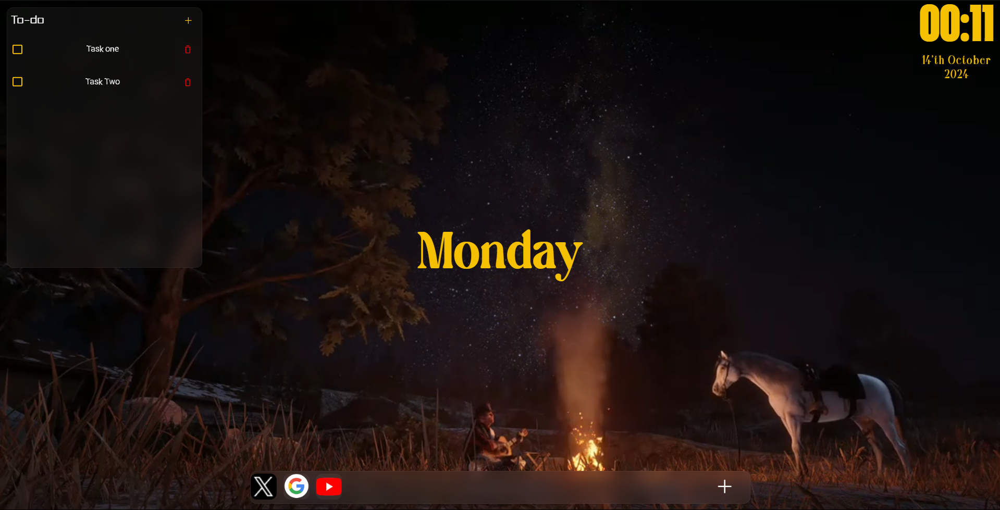

# Custom New Tab Extension

## Initial Release v1.0.0

Welcome to the Custom New Tab Extension! This browser extension replaces the default new tab page with a personalized, minimalist dashboard featuring a sleek clock display.

## Features

- **Clean Interface**: A distraction-free new tab experience.
- **Real-time Clock**: Displays the current time, updating every second.
- **Lightweight**: Minimal impact on browser performance.
- **Increase Productivity**: Reduce distraction with intutive UI

## Installation

1. Download the extension ZIP file.
2. Unzip the file to a location on your computer.
3. Open your Chromium-based browser (Chrome, Brave, Edge, etc.).
4. Navigate to `chrome://extensions/` or `brave://extensions/` (depending on your browser).
5. Enable "Developer mode" in the top right corner.
6. Click "Load unpacked" and select the unzipped extension folder.

## Usage

After installation, simply open a new tab to see your custom dashboard!

## Customization

Currently, the extension is not customizable at the user level. However, developers can modify the code to adjust the appearance and functionality:

- Edit `index.html` to change the layout and content.
- Modify `script.js` to alter the clock functionality or add new features.
- Adjust styles in the `style.css` to change colors, fonts, etc.

## TODO

- [ ] Implement user-level customization options
- [ ] Fix any reported bugs
- [ ] Refine and clean up the design
- [ ] Add more features (e.g., weather, to-do list)
- [ ] Optimize performance

## Contributing

Contributions are always welcomed! If you'd like to contribute, please:

1. Fork the repository
2. Create your feature branch (`git checkout -b feature/AmazingFeature`)
3. Commit your changes (`git commit -m 'Add some AmazingFeature'`)
4. Push to the branch (`git push origin feature/AmazingFeature`)
5. Open a Pull Request

## License

This project is licensed under the MIT License - see the [LICENSE.md](LICENSE.md) file for details.

## Contact

Alien501 - [cvignesh404@gmail.com](mailto:cvignesh404@gmail.com)

Project Link: [https://github.com/Alien501/custom-home-tab](https://github.com/Alien501/custom-home-tab)

---

We appreciate your interest in the Custom New Tab Extension! While this initial release has limited customization options, we're excited about the potential for growth and improvement. Your feedback and contributions can help shape the future of this extension, making it more useful and versatile for all users. Whether you're a user with feature ideas or a developer looking to contribute code, your input is valuable. Let's work together to create an amazing new tab experience!