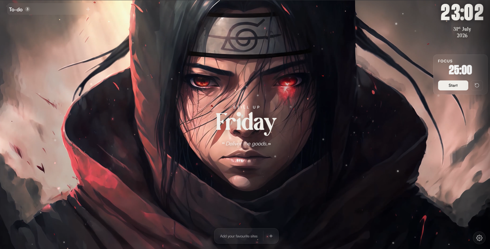

# Customisable New Tab Dashboard

A clean, distraction-free new tab page for Chromium-based browsers. It replaces the default new tab with a minimalist dashboard — clock, to-do list, bookmarks, a pomodoro timer, and more — all customisable from an in-page Settings panel, with everything stored locally in your browser.

<video src="/demo/demo.mp4" autoplay="true" muted loop></video>

## Features

- **Live clock & date** — updates every second, with an optional seconds display.
- **Greeting & daily focus** — a personal greeting plus a click-to-edit focus line, or a rotating daily quote when you haven't set one.
- **To-do list** — add, complete, and remove tasks, saved locally.
- **Bookmarks** — pin your most-visited sites with auto-fetched favicons.
- **Pomodoro timer** — configurable focus/break lengths, stays in sync across open tabs.
- **Custom background media** — upload your own image, GIF, or video, optionally on a time-of-day timeline (morning/afternoon/evening/night).
- **Accent colours & ambient embers** — pick an accent colour and toggle a subtle particle effect.
- **Spotify status widget** — optional now-playing widget, off and hidden by default until you add your UID.
- **Parallax effect** — subtle depth on mouse movement.
- **Fully local** — no accounts, no external storage; settings live in your browser's `localStorage`/`IndexedDB`.

Everything above is toggled or configured from the Settings panel (gear icon, bottom-right).

## Installation

1. Download the extension ZIP file.
2. Unzip the file to a location on your computer.
3. Open your Chromium-based browser (Chrome, Brave, Edge, etc.).
4. Navigate to `chrome://extensions/` or `brave://extensions/` (depending on your browser).
5. Enable "Developer mode" in the top right corner.
6. Click "Load unpacked" and select the unzipped extension folder.

## Usage

After installation, simply open a new tab to see your custom dashboard! Click the gear icon in the bottom-right corner to open Settings and customise it to your liking.

## Customization

Most customisation is available directly in the app via the Settings panel — name, focus line, accent colour, pomodoro lengths, background media, and which widgets are shown. For deeper changes, developers can edit the source:

- Edit `index.html` to change the layout and content.
- Modify `js/script.js` (clock, todo list, bookmarks) or the modules in `js/features/` (settings, pomodoro, embers, background, Spotify widget) to alter functionality or add new features.
- Adjust styles in `css/style.css` to change colors, fonts, etc.

## TODO

- [x] Implement user-level customization options
- [ ] Fix any reported bugs
- [x] Refine and clean up the design
- [ ] Add more features (e.g., weather)
- [x] Optimize performance

## Contributing

Contributions are always welcomed! If you'd like to contribute, please:

1. Fork the repository
2. Create your feature branch (`git checkout -b feature/AmazingFeature`)
3. Commit your changes (`git commit -m 'Add some AmazingFeature'`)
4. Push to the branch (`git push origin feature/AmazingFeature`)
5. Open a Pull Request

## Contact

Alien501 - [cvignesh404@gmail.com](mailto:cvignesh404@gmail.com)

Project Link: [https://github.com/Alien501/custom-home-tab](https://github.com/Alien501/custom-home-tab)
